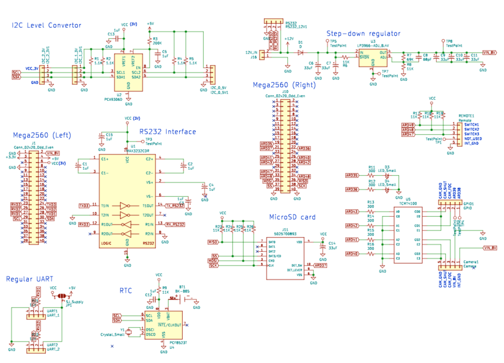
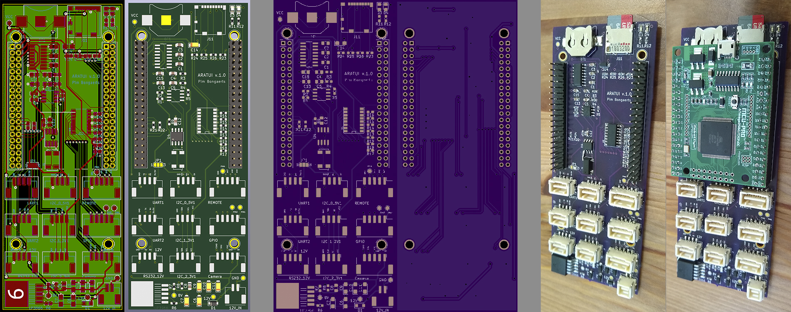
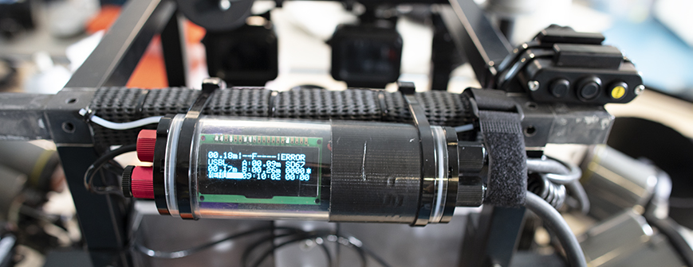

# Altimeter_v2

Intervalometer with serial interface based on Mega2560 MCU

*Current application:*

* Intervalometer for photogrammetry surveys (triggering a Canon 5DsR DSLR every second)
* Real-time sensor feedback underwater (through attached OLED display):
  * Levelling and altitude (through 2 x altimeters: [BlueRobotics Ping Sonar](https://bluerobotics.com/store/sensors-sonars-cameras/sonar/ping-sonar-r2-rp/))
  * Read-out USBL communications (through [BluePrint Subsea X150 USBL](https://www.blueprintsubsea.com/pages/product.php?PN=BP00795))
  * Depth and "bottom-depth" based on altitude (through [BlueRobotics Depth Sensor](https://bluerobotics.com/store/sensors-sonars-cameras/sensors/bar30-sensor-r1/))
  * Stopwatch & intervalometer count (triggered by Remora remote)
* Logging synchronized sensor data on SD card

*Features:*

* Real-time clock (RTC) for timekeeping
* SD-card reader to log sensor data
* 4-Channel Optocoupler to trigger camera(s)
* Step-down regulator to run board & DSLR camera off external battery (e.g. from dive propulsion vehicle)
* Supports I2C (3.3V or 5V logic), UART and RS232 sensors
* Connectors for remote controller & I2C or SPI display
* Headers to connect with [Robotdyn MCU-PRO Mega 2560 board](https://robotdyn.com/mcu-pro-mega-2560-atmega2560-16au-usb-ch340c-with-pinheaders-2-lines-pinheaders-pitch-0-1.html), which can be programmed using Arduino IDE
* Fits inside [BlueRobotics 2" watertight enclosure](https://bluerobotics.com/product-category/watertight-enclosures/) (see image below)

## Schematic

[PDF Schematic](altimeter_v2_schematic.pdf)

## Arduino code

[Arduino code](altimeter_v2.ino)

## PCB Design

[KiCad PCB file](altimeter_v2.kicad_pcb)

## Underwater housing

Image shows board installed in a [BlueRobotics 2" watertight enclosure](https://bluerobotics.com/product-category/watertight-enclosures/), and with a 20x4 OLED display connected. On the left side, there are penetrators for an on/off switch, a [BlueRobotics Depth Sensor](https://bluerobotics.com/store/sensors-sonars-cameras/sensors/bar30-sensor-r1/), and 2 x [BlueRobotics Ping Sonar](https://bluerobotics.com/store/sensors-sonars-cameras/sonar/ping-sonar-r2-rp/) (although on the photo only one connected, hence the "error" on the top-right of the display). On the right side, there is an Ikelite connector to connect with the camera (power and trigger), another Ikelite connector for the 3-button remote (Remora), a penetrator for a cable connecting with the Dive-Xtras Piranha DPV battery, and a penetrator for the cable connecting with the [BluePrint Subsea X150 USBL](https://www.blueprintsubsea.com/pages/product.php?PN=BP00795).